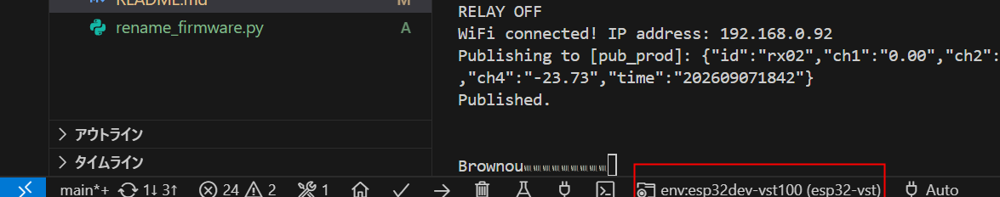
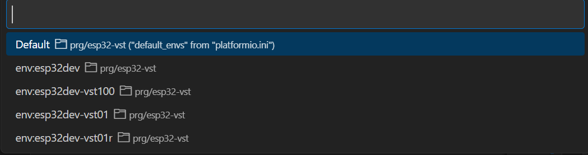
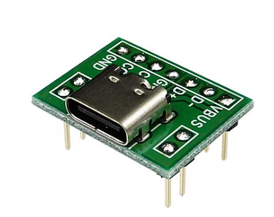
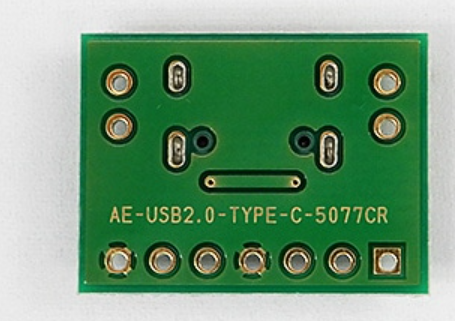

<h1>esp32 vst</h1>

measとcommを一体化

VST-01,VST-100ではmeasに、このソフトを焼く。commには、眠らせるソフトを焼くこと。commを眠らせないと、誤動作する。

# 条件コンパイル

開発モードOTAは、削除した。以前は、この機能を用意していたが、条件コンパイルの条件が複雑になる。OTAは便利だが、デバッグ時、シリアルの出力を見たい時は結局ケーブルを接続する。よって、OTAモードは不要と判断した。

エディタ画面の下をクリック



機種を選択すると、対象機種のマクロ（VST100 / VST01 / VST01R）およびファームウェアバージョン名が自動で定義されます。



.pioの下に、binファイルができる。

VST-100の場合

```
C:\local\prg\esp32-vst\.pio\build\esp32dev-vst100\
```

# comポート設定

1: 自動検出（Auto-detect）に任せる

portをコメントにする。

; upload_port = com6
; monitor_port = com6

2: ターミナルの環境変数で指定する

ターミナルで PlatformIO 用の環境変数をセットしておくと platformio.ini より優先される。

```
$env:PLATFORMIO_UPLOAD_PORT = "COM6"
$env:PLATFORMIO_MONITOR_PORT = "COM6"
```

以下でもとに戻る

```
Remove-Item Env:\PLATFORMIO_UPLOAD_PORT
Remove-Item Env:\PLATFORMIO_MONITOR_PORT
```

# USB Type-C を使う場合(次機種用忘備録)

秋月などのType-C to 2.54mmピッチ変換基板をダウンローダーとして使う。



Type-Cレセプタクルの CC1 と CC2 それぞれに 5.1kΩ のプルダウン抵抗（GNDへ接続）を必ず入れる。 これを忘れると、「Type-A to Type-Cケーブルでは動くのに、Type-C to Type-Cケーブル（PC直結）で認識・給電されない」というトラブルが起きる。

裏に5.1kΩを2個はんだ付け



ESD保護（静電気対策）:  
USB端子の D+ / D- ラインには、静電気破壊防止のためESD保護ダイオード（USBLC6-2SC6 など）を入れておくこと。
S3のUSBピンの割り当て:  
GPIO19：USB D-  
GPIO20：USB D+  
（内部に終端抵抗が内蔵されているため、ダンピング抵抗は外付けしなくても動作します）

# フラッシュメモリ・パーティション仕様

すべてのVSTシリーズには **ESP32-WROOM-32E-N16**（16MB Flash内蔵）が使用されている。
そのため、16MB Flash用のパーティション設定（`partitions_16MB.csv`）を採用

- **Flash容量**: 16MB (`board_upload.flash_size = 16MB`)
- **パーティション構成 (`partitions_16MB.csv`)**:
  - `app0` / `app1`: 各 約6.25MB (0x640000) - OTA二重化対応
  - `spiffs`: 約3.375MB (0x360000) - 設定・ログ保存用ストレージ
  - `nvs`: 20KB
  - `coredump`: 64KB
