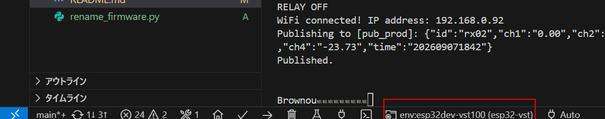
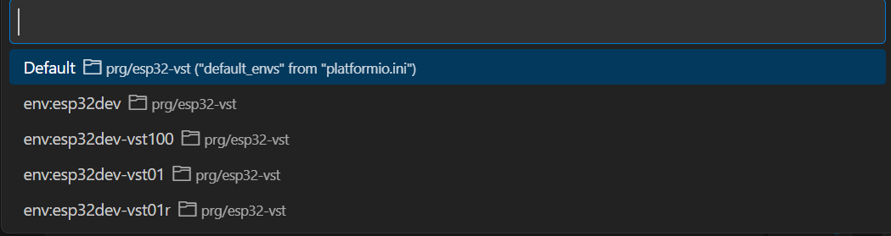
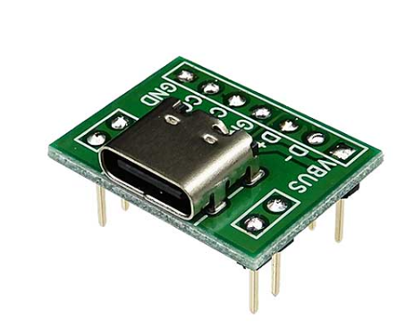
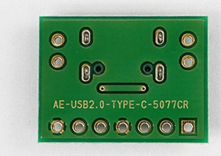

<h1>esp32 vst</h1>

measとcommを一体化

VST-01,VST-100ではmeasに、このソフトを焼く。commには、眠らせるソフトを焼くこと。commを眠らせないと、正常に動作しない。

- [条件コンパイル](#条件コンパイル)
- [COMポート設定](#comポート設定)
    - [1. 通常の動作（自動記憶機能）](#1-通常の動作自動記憶機能)
    - [2. その他の指定方法（任意）](#2-その他の指定方法任意)
- [フラッシュメモリ・パーティション仕様](#フラッシュメモリパーティション仕様)
- [事前暗号化方式 (Pre-encrypted Flashing)](#事前暗号化方式-pre-encrypted-flashing)
- [Web OTA](#web-ota)
- [暗号化解除](#暗号化解除)
- [USB Type-C を使う場合(次機種用忘備録)](#usb-type-c-を使う場合次機種用忘備録)


# 条件コンパイル

開発モードOTAは、削除した。以前は、この機能を用意していたが、条件コンパイルの条件が複雑になる。OTAは便利だが、デバッグ時、シリアルの出力を見たい時は結局ケーブルを接続する。よって、回待つモードOTAモードは不要と判断した。

エディタ画面の下をクリック



機種を選択すると、対象機種のマクロ（VST100 / VST01 / VST01R）およびファームウェアバージョン名が自動で定義されます。



.pioの下に、binファイルができる。

VST-100の場合

```
C:\local\prg\esp32-vst\.pio\build\esp32dev-vst100\
```

# COMポート設定

プロジェクト内の `select_port.py` スクリプトにより、Arduino IDE と同様に **「一度選択したCOMポートが自動記憶」** されます。

### 1. 通常の動作（自動記憶機能）
- **ポートが1つだけの場合**: 自動検出してそのまま書き込み・モニターが開始されます。
- **複数ポートが検出された場合**:
  - 初回: ターミナルに対話メニューが表示され、番号でポートを選択します。選択結果は `.pio/.last_selected_port` に自動保存されます。
  - 2回目以降: 保存されたポート（例: `COM9`）が接続されていれば、**入力を求められることなく自動選択** され、ビルド・書き込み・モニターがスムーズに続行します。
- **接続ポートを変更したい場合**:
  `.pio/.last_selected_port` ファイルを削除するか、VSCode右下のタスク・ターミナルで再選択します。

### 2. その他の指定方法（任意）
手動で明示的にポートを指定したい場合は、以下の方法も利用できます。

* **ターミナルの環境変数で指定する場合（一時的な上書き）**:
  ```powershell
  $env:PLATFORMIO_UPLOAD_PORT = "COM9"
  $env:PLATFORMIO_MONITOR_PORT = "COM9"
  ```
  ※解除する場合:
  ```powershell
  Remove-Item Env:\PLATFORMIO_UPLOAD_PORT
  Remove-Item Env:\PLATFORMIO_MONITOR_PORT
  ```

* **`platformio.ini` で固定する場合**:
  ```ini
  upload_port = COM9
  monitor_port = COM9
  ```

# フラッシュメモリ・パーティション仕様

すべてのVSTシリーズには **ESP32-WROOM-32E-N16**（16MB Flash内蔵）が使用されている。
そのため、16MB Flash用のパーティション設定（`partitions_16MB.csv`）を採用

- **Flash容量**: 16MB (`board_upload.flash_size = 16MB`)
- **パーティション構成 (`partitions_16MB.csv`)**:
  - `app0` / `app1`: 各 約6.25MB (0x640000) - OTA二重化対応
  - `spiffs`: 約3.375MB (0x360000) - 設定・ログ保存用ストレージ
  - `nvs`: 20KB
  - `coredump`: 64KB


# 事前暗号化方式 (Pre-encrypted Flashing)	

PC 上でキーを用いてバイナリを先に暗号化 し、Flash に書き込む方式。

ステップ 1: ツール環境の整備  
PlatformIO の Python 環境に、暗号化・eFuse 操作に必要なライブラリを導入。

```
python -m pip install pyyaml cryptography
```

ステップ 2: 暗号化キーの生成（Host-generated Key）  
PC 側で 256bit（32 バイト）の暗号化キーを生成。

```
espsecure.py generate_flash_encryption_key my_flash_encryption_key.bin
```

ステップ 3: PC 上での事前暗号化  
生成したキーでブートローダー全バイナリの暗号化版（*_enc.bin）を作成。

```
# ① ブートローダー (0x1000)
espsecure.py encrypt_flash_data --keyfile my_flash_encryption_key.bin --address 0x1000 --output bootloader_enc.bin .pio\build\esp32dev\bootloader.bin

# ② パーティションテーブル (0x8000)
espsecure.py encrypt_flash_data --keyfile my_flash_encryption_key.bin --address 0x8000 --output partitions_enc.bin .pio\build\esp32dev\partitions.bin

# ③ boot_app0 (0xe000: OTAブート用データ)
espsecure.py encrypt_flash_data --keyfile my_flash_encryption_key.bin --address 0xe000 --output boot_app0_enc.bin "$env:USERPROFILE\.platformio\packages\framework-arduinoespressif32\tools\partitions\boot_app0.bin"

# ④ アプリ本体ファームウェア (0x10000)
espsecure.py encrypt_flash_data --keyfile my_flash_encryption_key.bin --address 0x10000 --output firmware_enc.bin .pio\build\esp32dev\firmware.bin
```

ステップ 4: eFuse へのキー登録 & 暗号化の有効化
手動でダウンロードモード（BOOT押しながらRESET）にした ESP32 に対し、eFuse を設定。

ここではお試しなので②は実行していない。このため、keyをリードできる。製品では、必ず②を実行すること。

```
# ① キーを BLOCK1 に書き込む（必須）
espefuse.py --port com6 --before no_reset --do-not-confirm burn_key flash_encryption my_flash_encryption_key.bin

# ② キーの読み出しを永久に禁止する（完全ロック・推奨）
espefuse.py --port com6 --before no_reset read_protect_efuse BLOCK1
```

ステップ 5:暗号化設定（Tweak設定）:

```
espefuse.py --port com6 --before no_reset --do-not-confirm burn_efuse FLASH_CRYPT_CONFIG 0xF
```
FLASH_CRYPT_CONFIG とは？（Tweak設定とは何か）

ESP32 のハードウェア AES 暗号化には、「Flash のアドレス位置によって、暗号化キーを微妙に変形（ツイーク / Tweak）させる機能」 が備わっています。

もし Tweak がないとどうなるか？: Flash 内の別々の場所に「全く同じデータ（例: プログラムの空き領域である 0xFF の連続など）」があった場合、暗号化しても 全く同じ暗号文 が並んでしまいます。これだとハッカーに「ここは空き領域だな」「ここは同じ関数だな」と推測されてしまいます。  
Tweak があるとどうなるか？: 「同じデータであっても、Flash のアドレス（番地）が違えば、全く別のランダムな暗号文になる」 ようになります。ハッカーによるパターン解析を完全に防ぐための強力な仕組みです。

なぜ 0xF なのか？  
FLASH_CRYPT_CONFIG は 4ビット（0x0 〜 0xF） のヒューズです。

0xF は 2進数で表すと 0b1111（4ビットすべてが 1） です。
4ビットすべてを 1 にすることで、「ESP32 のハードウェアが持っている最大の鍵変形（Tweak）をフルパワーで有効化する」 という意味になります。 Espressif の公式仕様上、ESP32 でフラッシュ暗号化を動かす際は 0xF に設定することが必須の標準仕様 と定められています。


ステップ 6:暗号化の有効化

```
espefuse.py --port com6 --before no_reset --do-not-confirm burn_efuse FLASH_CRYPT_CNT 1
```

※ 奇数個のビット（1）をセットすることで、ESP32 のハードウェア AES 復号エンジンが稼働。

ステップ 7: 暗号化バイナリの Flash 書き込み  
PC 上で暗号化したバイナリを各オフセットアドレスに書き込み。

```
esptool.py --port com6 --baud 921600 --before no_reset write_flash `
  0x1000 bootloader_enc.bin `
  0x8000 partitions_enc.bin `
  0xe000 boot_app0_enc.bin `
  0x10000 firmware_enc.bin
```

5. 今後の運用ルール

日常の開発・書き換え:
1. **VS Code / PlatformIO からの OTA**:
   `pio run -e esp32dev_ota -t upload`（または VS Code のアップロードボタン）で、Wi-Fi 経由で書き換えるのがベスト（回数制限ゼロ、数秒で完了、手動ボタン操作不要）。
2. **ブラウザからの Web OTA (ファイル選択書き込み)**:
   ブラウザで **`http://vst-comm-dummy.local/`**（または AP モード時 `http://192.168.4.2/`）を開き、PC 上の `.bin` ファイルを選択して「🚀 書き込み開始」を押すだけで、ツールやコマンドなしで直接ファームウェアを書き換え可能。

キーファイルの管理:
プロジェクトルートにある my_flash_encryption_key.bin は、この ESP32 チップ専用の鍵です。Git リポジトリに公開しないよう厳重に保管してください。

2台目以降の量産・複製:
同じキー（my_flash_encryption_key.bin）を使って同じ手順で書き込めば、全台共通バイナリで何台でも複製可能です。

# Web OTA

Web OTA（ブラウザからの書き込み）や VS Code の OTA は、ESP32 内部の暗号化ハードウェアが「平文を受け取って、自動で暗号化しながら Flash に書く」仕組み になっています。
そのため、Web OTA では 通常の .pio\build\esp32dev_ota\firmware.bin をそのまま選択してアップロードしてください（ESP32 が自動で暗号化して保存してくれます）。

# 暗号化解除

1. 手動ダウンロードモードにする（BOOT押しながらRESET）

2. 現在の eFuse 確認

```py
espefuse.py --port com6 summary
```

暗号化を一度だけしていたときのeFuse 状態


eFuse	値	意味  
FLASH_CRYPT_CNT	1 (0b0000001)	1ビットON（奇数）→ 暗号化 有効  
FLASH_CRYPT_CONFIG	15 (0xF)	Tweak フルパワー有効  
BLOCK1 (暗号化キー)	a3 6c aa ...	読み取り可能（保護されていない）  
RD_DIS	0	BLOCK1-3 の読み出し 禁止されていない  
WR_DIS	0	書き込み 禁止されていない  
UART_DOWNLOAD_DIS	False	UART ダウンロード 有効  

3. FLASH_CRYPT_CNT をもう1ビット焼く（1→2にして偶数にする）

```
espefuse.py --port com6 --before no_reset --do-not-confirm burn_efuse FLASH_CRYPT_CNT 3
```

eFuse は「0→1」にしか書けない（不可逆）。現在の値が1なので、3を焼くことで、偶数（2）になって復号が有効になる。

4. 平文バイナリで全領域を書き直す

```
esptool.py --port com6 --baud 921600 --before no_reset write_flash \
  0x1000 .pio\build\esp32dev\bootloader.bin \
  0x8000 .pio\build\esp32dev\partitions.bin \
  0xe000 "$env:USERPROFILE\.platformio\packages\framework-arduinoespressif32\tools\partitions\boot_app0.bin" \
  0x10000 .pio\build\esp32dev\firmware.bin
```

# USB Type-C を使う場合(次機種用忘備録)

秋月などのType-C to 2.54mmピッチ変換基板をダウンローダーとして使う。



Type-Cレセプタクルの CC1 と CC2 それぞれに 5.1kΩ のプルダウン抵抗（GNDへ接続）を必ず入れる。 これを忘れると、「Type-A to Type-Cケーブルでは動くのに、Type-C to Type-Cケーブル（PC直結）で認識・給電されない」というトラブルが起きる。

裏に5.1kΩを2個はんだ付け



ESD保護（静電気対策）:  
USB端子の D+ / D- ラインには、静電気破壊防止のためESD保護ダイオード（USBLC6-2SC6 など）を入れておくこと。
S3のUSBピンの割り当て:  
GPIO19：USB D-  
GPIO20：USB D+  
（内部に終端抵抗が内蔵されているため、ダンピング抵抗は外付けしなくても動作します）

